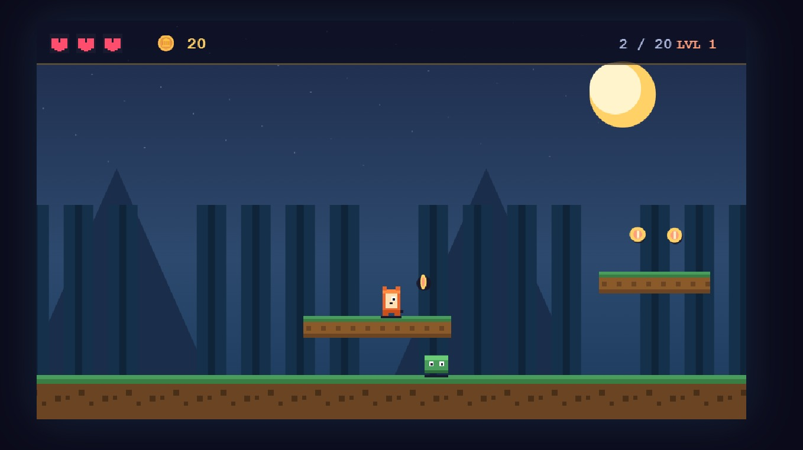

# Pixel-Adventure

A cute pixel-art 2D platformer built with HTML Canvas and vanilla JavaScript. Collect coins, stomp slimes, avoid spikes, and reach the flag!

---

## ✨ Features

- 🎮 **Smooth platformer physics** — coyote time, jump buffering, air control
- 🦖 **Animated pixel-art** — with directional sprites and running frames
- 🟢 **Enemy slimes** — patrol platforms, stomp them to defeat
- 🪙 **Collectible coins** — with particle effects and floating score popups
- ⚠️ **Deadly spikes** — timing-based hazards
- ❤️ **Health system** — 3 hearts with invulnerability frames
- 🎯 **Goal flag** — reach it to win the level
- 🏆 **Score & progression** — collect coins, defeat enemies, advance levels
- 🔊 **Sound effects** — pure Web Audio API (no audio files needed)
- 🌄 **Parallax backgrounds** — mountains, trees, twinkling stars
- 📱 **Responsive controls** — keyboard on desktop, touch buttons on mobile
- ⏸️ **Pause support** — press P

---

## 🎮 Controls

| Action | Desktop | Mobile |
|--------|---------|--------|
| Move Left | `←` or `A` | ◀ button |
| Move Right | `→` or `D` | ▶ button |
| Jump | `Space`, `↑`, or `W` | ▲ button |
| Pause | `P` | — |

---

## 🚀 How to Play

1. Clone or download this repo
2. Open `index.html` in any modern browser
3. Click **Start Game**
4. Collect coins, dodge spikes, stomp slimes, and reach the red flag 🚩

No build step. No dependencies. No install.

---

## 🛠 Tech Stack

| Technology | Purpose |
|------------|---------|
| HTML5 Canvas | Rendering |
| Vanilla JS (ES6) | Game loop, physics, entities, state |
| Web Audio API | Synthesized sound effects |
| CSS3 | Overlays, HUD, responsive layout |

No libraries. No frameworks. ~800 lines of pure JS.

---

## 🧠 How It Works

- **Game loop** runs on `requestAnimationFrame` with fixed-step physics
- **Entities** (`Player`, `Enemy`) inherit from a base `Entity` class with AABB collision
- **Physics** include gravity, friction, coyote time, jump buffering — feels great to play
- **Camera** smoothly follows the player with parallax scrolling backgrounds
- **Levels** are data-driven — just arrays of platforms, coins, enemies, spikes, and a goal
- **Particles** are lightweight objects with life timers for coin/enemy hit effects

---

